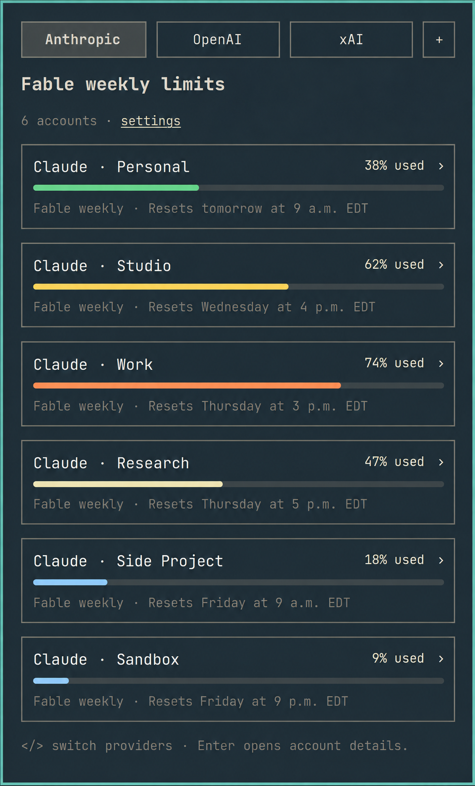
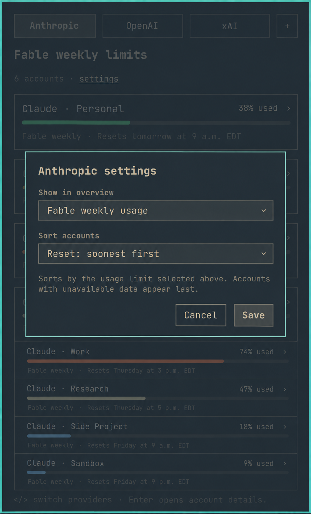

# My Agents for Omarchy

Multi-account AI usage tracking in a native Omarchy bar panel.

[](https://github.com/davefano/omarchy-agents-plus/actions/workflows/checks.yml)
[](LICENSE)

My Agents shows subscription allowance, reset times, and local activity for your
AI coding accounts without sending credentials to another service. Switch
between Anthropic, OpenAI, xAI, and Fireworks from one panel; compare multiple
accounts; and open details without leaving the Omarchy bar.

<p align="center">
  
  
</p>

> The screenshots contain fictional demo accounts and fabricated usage values.
> No personal account information or live provider data is included.

## Highlights

- **One panel, several providers.** Company tabs keep Anthropic, OpenAI, xAI,
  and Fireworks records organized without mixing accounts.
- **Multiple accounts.** Default and additional Claude, Codex, and Grok logins
  remain isolated in their own CLI configuration directories.
- **Useful allowance views.** Choose which reported limit appears in the
  overview, then sort accounts by usage or reset time.
- **Local reset times.** Reset labels follow the computer's time zone and use
  the correct daylight-saving offset at the reset instant.
- **Account controls.** Add, re-authenticate, and rename supported accounts from
  the panel while preserving the underlying login directory.
- **Deeper details.** Inspect session limits, weekly limits, local token
  history, and model usage when the provider exposes them.
- **Keyboard friendly.** Navigate providers and accounts, open details, add an
  account, change settings, and refresh without reaching for the mouse.
- **Local-first.** Credentials stay in the provider CLIs' existing account
  stores. The plugin writes display records, not authentication secrets.

## Provider support

| Provider | Allowance data | Multiple accounts | Account actions |
| --- | --- | --- | --- |
| Anthropic / Claude | Session, overall weekly, and model-specific weekly limits when reported | Additional accounts through [Claude Accounts](https://github.com/leciric/omarchy-claude-multi-account-usage) | Add, re-authenticate, rename |
| OpenAI / Codex | Subscription limits through the installed Codex app-server RPC | Built in with separate `CODEX_HOME` directories | Add, re-authenticate, rename |
| xAI / Grok | Account allowance and reset time from the Grok CLI billing service | Built in with separate `GROK_HOME` directories | Add, re-authenticate, rename |
| Fireworks | Records produced by Omarchy's installed collector | Collector dependent | View usage |

My Agents uses supported provider integrations rather than scanning arbitrary
executables. A new CLI needs an adapter for account discovery, authentication,
and whatever usage information that provider makes available.

## Requirements

- Omarchy with the Quickshell desktop and plugin support
- Omarchy's installed `omarchy-agent-usage-*` collectors
- Python 3.10 or later; no third-party Python packages are required
- The CLI for each provider you want to display
- A recent Codex CLI for OpenAI subscription limits
- A Claude CLI that supports the noninteractive usage flags used by
  `refresh_usage.py`

This plugin extends Omarchy's stock Agents widget and depends on the collector
and UI interfaces installed by Omarchy.

## Install

Clone the repository into a stable path. The installer links the live plugin to
that checkout, so moving it later requires rerunning the installer.

```bash
git clone https://github.com/davefano/omarchy-agents-plus.git ~/workspaces/omarchy-agents-plus
cd ~/workspaces/omarchy-agents-plus
python3 scripts/install-local.py
omarchy plugin enable davidfano.agents
omarchy plugin disable omarchy.agents
omarchy-shell shell rescanPlugins
```

If the shell keeps an older QML component cached, restart it once:

```bash
omarchy restart shell
```

The installer creates these links:

- `~/.config/omarchy/plugins/davidfano.agents` → the repository checkout
- `~/.local/bin/codex-account` → the included Codex account launcher

Existing installations are moved into timestamped directories under
`~/.local/state/omarchy/agents/backups/` before a link is replaced. Re-running
the installer against the same checkout is safe. `XDG_CONFIG_HOME` and
`XDG_STATE_HOME` are honored.

## Update

Pull the latest code from the checkout and ask the shell to rediscover plugins:

```bash
cd ~/workspaces/omarchy-agents-plus
git pull --ff-only
omarchy-shell shell rescanPlugins
```

Run `omarchy restart shell` only if the visible panel remains cached.

## Add and manage accounts

Open My Agents and select **+** beside the provider tabs. Choose **Anthropic**,
**OpenAI**, or **xAI (Grok)**, enter a display name, and select **Go**. The
provider's normal browser sign-in opens in a terminal using an isolated account
directory.

The helper registers an account only after a successful login. It rejects
duplicate names, existing credentials, conflicting directories, and incomplete
sign-ins. Existing accounts, disabled entries, and overview settings are
preserved.

From account details:

- **re-auth** signs into the selected account's existing directory without
  changing its display name or other accounts.
- **edit** changes only the display name shown by My Agents.
- **R** refreshes usage immediately.

Extra Anthropic accounts require the Claude Accounts plugin. Default Claude,
Codex, and Grok logins continue to use their normal CLI locations.

### Codex from the command line

The included launcher remains available when a terminal workflow is faster:

```bash
codex-account work login
codex-account personal login
```

Run an account later with:

```bash
codex-account work
```

Plain `codex` continues to use the default login. Extra logins are discovered
from `~/.codex-<label>/auth.json` and receive separate usage records and caches.

For explicit names or nonstandard directories, create
`~/.config/omarchy/agents/codex-accounts.json`:

```json
{
  "accounts": [
    {"id": "work", "name": "Codex · Work", "configDir": "~/.codex-work"},
    {"id": "personal", "name": "Codex · Personal", "configDir": "~/.codex-personal"}
  ]
}
```

An explicit list replaces automatic discovery. Include every extra account you
want displayed, or set `"enabled": false` on entries you want hidden. Keep IDs
stable when changing display names.

Inspect discovery without contacting a provider:

```bash
python3 codex_accounts.py list
```

### Grok accounts

The default Grok login is read from `$GROK_HOME/auth.json`, normally
`~/.grok/auth.json`. Additional logins use `~/.grok-<label>/auth.json` or an
explicit `~/.config/omarchy/agents/grok-accounts.json` file.

To use an extra account directly with the CLI:

```bash
GROK_HOME="$HOME/.grok-work" grok
```

My Agents reports Grok account allowance and reset times. Daily token history
is not connected yet, and the panel says so instead of estimating it.

## Overview settings

Select **settings** beside the account count, or press **S**, to configure the
current provider.

- Choose the limit used by the overview meter. Anthropic can expose overall
  weekly, model-specific weekly, and session limits.
- Sort by least or most used, soonest or latest reset, or retain provider order.
- Accounts missing the selected metric remain visible and sort last.
- Settings are saved separately for each provider.

Account details always retain every limit reported by the collector, regardless
of the metric selected for the overview.

## Controls

| Action | Control |
| --- | --- |
| Switch provider | Click a tab or Left/Right (`h`/`l`) |
| Select an account | Up/Down (`k`/`j`) |
| Open account details | Click a row or Enter |
| Change account in details | Account dropdown |
| Open overview settings | **settings** or `S` |
| Add an account | **+** or `+` |
| Refresh usage | `R` |
| Return to overview / close | Escape |
| Cycle provider from the bar | Middle-click |

The inherited IPC target remains available:

```bash
omarchy-shell omarchy.agents open
omarchy-shell omarchy.agents close
omarchy-shell omarchy.agents refresh
omarchy-shell omarchy.agents next
```

## Privacy and local data

My Agents does not include credentials in usage records, identity caches, or
helper output.

- Provider credentials remain in their normal Claude, Codex, and Grok account
  directories.
- Anthropic identity is checked against the token's profile so stale local
  metadata cannot label the wrong login.
- OpenAI identity comes from the selected account's saved ID token and is read
  locally.
- API-key logins are shown without an account email.
- Identity caches are separated by account directory and invalidated when the
  saved login changes.
- Personal configuration and all authentication files are ignored by git.

Important local paths:

| Purpose | Path |
| --- | --- |
| Display records | `~/.local/state/omarchy/agents/usage/` |
| Codex account configuration | `~/.config/omarchy/agents/codex-accounts.json` |
| Grok account configuration | `~/.config/omarchy/agents/grok-accounts.json` |
| Collector caches | `~/.cache/omarchy/` |
| Installer backups | `~/.local/state/omarchy/agents/backups/` |

## Usage data and limitations

Allowance values come from provider integrations. Token history is local unless
you configure Omarchy's snapshot sync.

- Extra Codex records scan native Codex sessions from the last 30 days.
- Shared pi/OpenCode history is excluded because it cannot be attributed to one
  saved Codex account.
- Signing in on a new computer does not import that account's historical local
  activity from another machine.
- Grok currently supplies allowance and reset information, not daily token
  history.
- Reset times use the computer's configured time zone, not geolocation.
- An expired reset timestamp remains marked as past due until the provider
  returns fresh data.

## Development

The installer deliberately links the checkout into Omarchy, so edits can reload
the live widget. Keep real credentials, account configuration, usage snapshots,
and unredacted desktop captures outside the repository.

Run the helper test suite:

```bash
python3 -m unittest discover -v
```

Tests use temporary directories and fake credentials; they do not contact live
providers. Validate the manifest with:

```bash
python3 -m json.tool manifest.json >/dev/null
```

For QML changes, inspect provider tabs, the account overview, account details,
and dialogs on an Omarchy desktop. Then check recent shell logs:

```bash
qs log -n -p /usr/share/omarchy/shell --no-color -t 30
```

Implementation notes live in [LOCAL-CHANGES.md](LOCAL-CHANGES.md). The
[upstream Agents README](docs/upstream-agents.md) documents inherited record,
Fireworks, and snapshot-sync behavior.

## License and origin

MIT. Derived from [Omarchy](https://github.com/omacom/omarchy); its copyright
notice is retained in [LICENSE](LICENSE). The plugin ID remains
`davidfano.agents` so existing bar settings continue to work.
